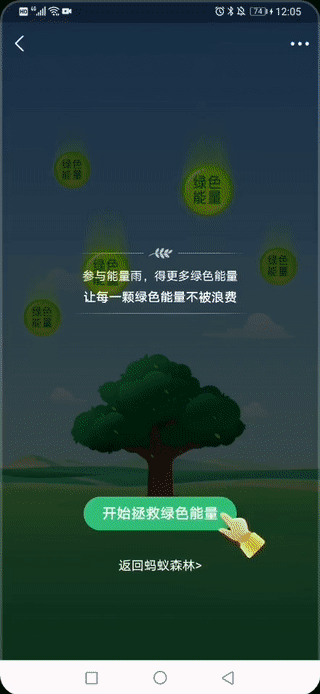

# 蚂蚁森林能量雨自动收集

基于adb、monkeyrunner和opencv的能量雨自动收集脚本。

## Demo

## 运行步骤
- 连接usb线，打开开发者模式，打开USB调试
- 根据实际设备，调整下列代码中的参数
- 打开三个命令行窗口，依次运行下列命令
  - python adb_snapshoter.py
  - python detect_click.py
  - monkeyrunner perform_click.py
- 开始支付宝蚂蚁森林能量雨收集